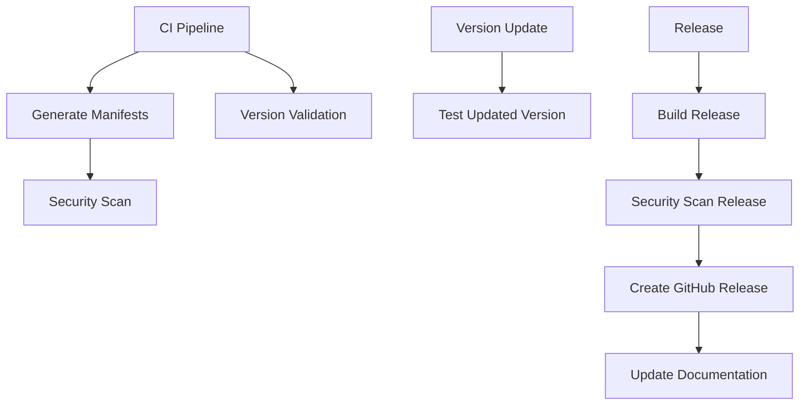

# GitHub Actions Workflows

This directory contains comprehensive GitHub Actions workflows for the CSS Kustomize project, providing automated CI/CD pipelines for linting, testing, manifest generation, version management, and releases.

## 🚀 Available Workflows

### 1. CI Pipeline (`ci.yml`)

**Triggers:**

- Push to `main` or `develop` branches
- Pull requests to `main` or `develop` branches
- Manual dispatch

**Jobs:**

- **Linting and Validation**: Sequential linting of YAML, Python, Kustomize, and security checks
- **Parallel Linting**: High-performance parallel execution of all linting tasks
- **Generate Manifests**: Creates Kubernetes manifests for all overlays
- **Complete CI Pipeline**: Runs the full dagger-pipeline CI command
- **Version Validation**: Checks version consistency across overlays
- **Documentation**: Builds and deploys docs (controlled by `LOCAL_DEV` variable)
- **Security Scanning**: Comprehensive security analysis of generated manifests
- **Test Dagger**: Runs the test-dagger.py script

**Key Features:**

- Poetry dependency caching for faster builds
- Artifact uploads for generated manifests
- LOCAL_DEV environment variable support
- Comprehensive error handling and reporting

### 2. Version Update (`version-update.yml`)

**Triggers:**

- Manual dispatch with version input

**Parameters:**

- `version`: New version (e.g., `1.2.3` or `1.2.3-beta.1`)
- `overlay`: Specific overlay to update (optional, updates all if empty)
- `dry_run`: Preview changes without applying them

**Jobs:**

- **Validate Version**: Ensures semantic version format
- **Update Version**: Updates image tags and version labels
- **Test Updated Version**: Validates the updated configuration

**Usage Examples:**

```bash
# Update all overlays to version 1.2.3
# Go to Actions → Version Update → Run workflow
# Version: 1.2.3
# Overlay: (leave empty)
# Dry run: false

# Preview changes for specific overlay
# Version: 1.2.3-beta.1
# Overlay: with-pvc
# Dry run: true
```

### 3. Release (`release.yml`)

**Triggers:**

- Push of version tags (e.g., `v1.2.3`)
- Manual dispatch with tag input

**Parameters (manual dispatch):**

- `tag`: Release tag (e.g., `v1.2.3`)
- `prerelease`: Mark as pre-release

**Jobs:**

- **Validate Release**: Extracts and validates version from tag
- **Build Release**: Creates comprehensive release artifacts
- **Security Scan**: Validates release security
- **Create GitHub Release**: Publishes release with artifacts
- **Update Documentation**: Updates docs with release info

**Release Artifacts:**

- `css-kustomize-{version}.tar.gz`: Complete release archive
- `css-kustomize-{version}.zip`: Complete release archive (zip)
- Generated Kubernetes manifests
- Base configurations and overlays
- Documentation and version info

### 4. Development (`dev.yml`)

**Triggers:**

- Manual dispatch with task selection

**Available Tasks:**

- `setup`: Initialize development environment
- `lint-only`: Run comprehensive linting
- `generate-only`: Generate manifests only
- `security-scan`: Security analysis
- `version-report`: Generate version consistency report
- `test-all`: Complete test suite
- `parallel-test`: High-performance parallel testing

**Parameters:**

- `task`: Development task to run
- `verbose`: Enable detailed output

## 🔧 Environment Variables

### LOCAL_DEV Variable

The `LOCAL_DEV` repository variable controls documentation publishing:

- **Not set or `false`**: Documentation is built and published to GitHub Pages
- **Set to `true`**: Documentation building and publishing is skipped

**Setting up LOCAL_DEV:**

1. Go to your repository → Settings → Secrets and variables → Actions
1. Click "Variables" tab
1. Click "New repository variable"
1. Name: `LOCAL_DEV`
1. Value: `true` (to disable docs) or leave unset (to enable docs)

## 📋 Workflow Dependencies



## 🛠️ Local Development Commands

All workflows use the dagger-pipeline CLI. You can run these commands locally:

```bash
# Install dependencies
poetry install

# Run complete CI pipeline
poetry run dagger-pipeline ci --verbose

# Run specific linting
poetry run dagger-pipeline lint --yaml-only
poetry run dagger-pipeline lint --python-only
poetry run dagger-pipeline lint --kustomize-only
poetry run dagger-pipeline lint --security-only

# Generate manifests
poetry run dagger-pipeline generate
poetry run dagger-pipeline generate-parallel

# Version management
poetry run dagger-pipeline version validate
poetry run dagger-pipeline version report
poetry run dagger-pipeline version update 1.2.3
poetry run dagger-pipeline version update 1.2.3 --overlay with-pvc --dry-run

# Setup development environment
poetry run dagger-pipeline setup

# Run parallel operations (faster)
poetry run dagger-pipeline lint-parallel
poetry run dagger-pipeline generate-parallel
```

## 🔍 Monitoring and Debugging

### Workflow Status

Monitor workflow status in the Actions tab:

- ✅ Green: All jobs passed
- ❌ Red: One or more jobs failed
- 🟡 Yellow: Jobs in progress or skipped

### Artifacts

Workflows generate artifacts for debugging and review:

- **CI Manifests**: Generated Kubernetes manifests
- **Release Artifacts**: Complete release packages
- **Development Artifacts**: Test results and logs

### Logs and Debugging

Enable verbose output for detailed logs:

- CI Pipeline: Automatic verbose output
- Version Update: Uses `--verbose` flag
- Development: Configurable verbose parameter

### Common Issues

1. **Poetry Cache Issues**:

   ```bash
   # Clear cache in Actions
   # Delete .venv cache key in repository settings
   ```

1. **Version Format Errors**:

   ```bash
   # Ensure version follows semantic versioning
   # Valid: 1.2.3, 1.2.3-beta.1, 1.2.3-alpha.1
   # Invalid: v1.2.3, 1.2, 1.2.3.4
   ```

1. **LOCAL_DEV Configuration**:

   ```bash
   # Check repository variables in Settings → Actions
   # Ensure LOCAL_DEV is set correctly
   ```

## 🚀 Getting Started

1. **First Time Setup**:

   ```bash
   # Run development workflow with 'setup' task
   # This initializes the development environment
   ```

1. **Regular Development**:

   ```bash
   # Use 'test-all' or 'parallel-test' tasks
   # These provide comprehensive validation
   ```

1. **Version Updates**:

   ```bash
   # Use version-update workflow
   # Always test with dry-run first
   ```

1. **Releases**:

   ```bash
   # Create and push version tag
   git tag v1.2.3
   git push origin v1.2.3
   # Or use manual dispatch
   ```

## 📚 Additional Resources

- [Dagger Pipeline Documentation](../docs/developer-guide/dagger-pipeline.md)
- [Version Management Strategy](../VERSION_STRATEGY.md)
- [Release Name Strategy](../RELEASE_NAME_STRATEGY.md)
- [Contributing Guidelines](../docs/developer-guide/contributing.md)

## 🤝 Contributing

When contributing to workflows:

1. Test changes in a fork first
1. Use descriptive commit messages
1. Update this README for new workflows
1. Ensure backward compatibility
1. Add appropriate error handling

## 📞 Support

For workflow issues:

1. Check the Actions tab for detailed logs
1. Review this documentation
1. Check the dagger-pipeline documentation
1. Create an issue with workflow logs
